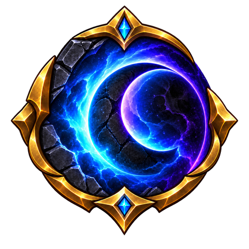
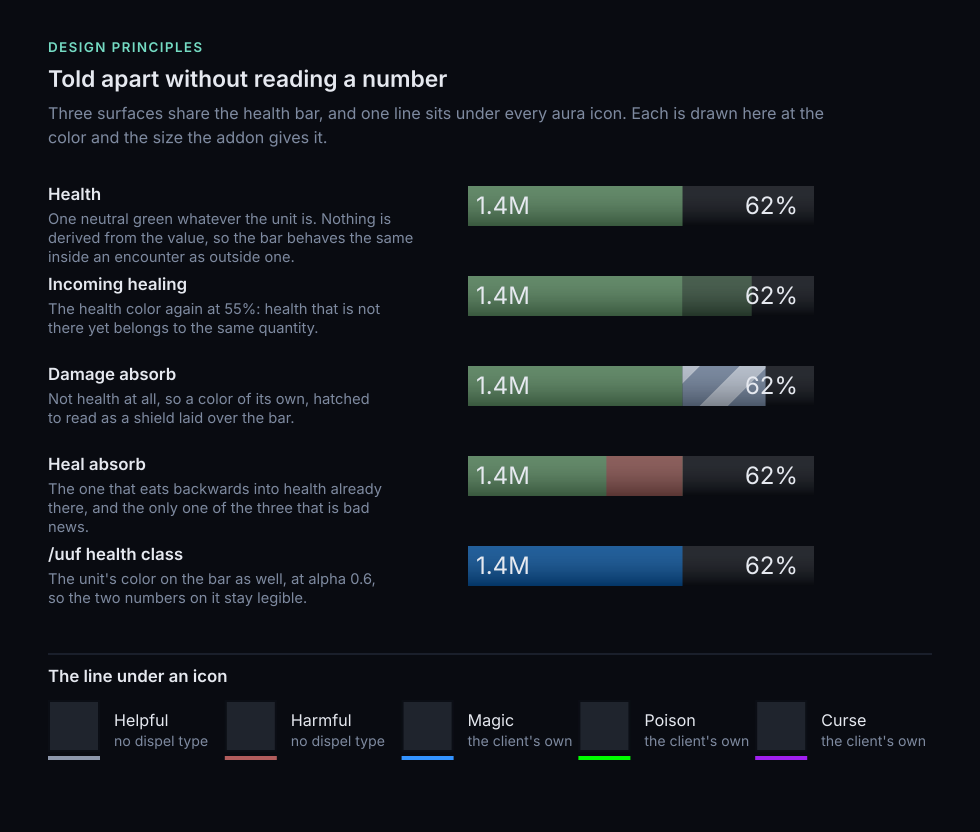
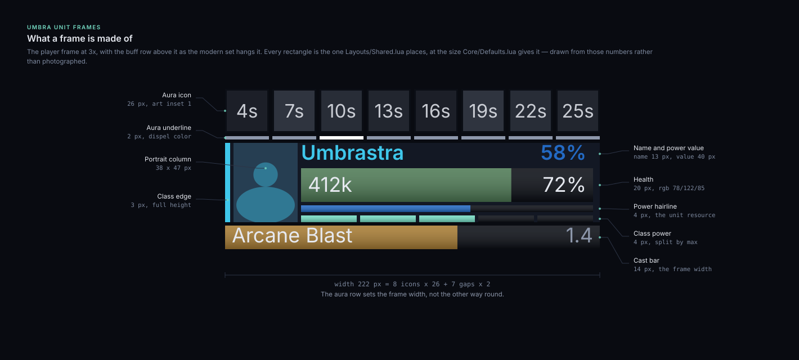
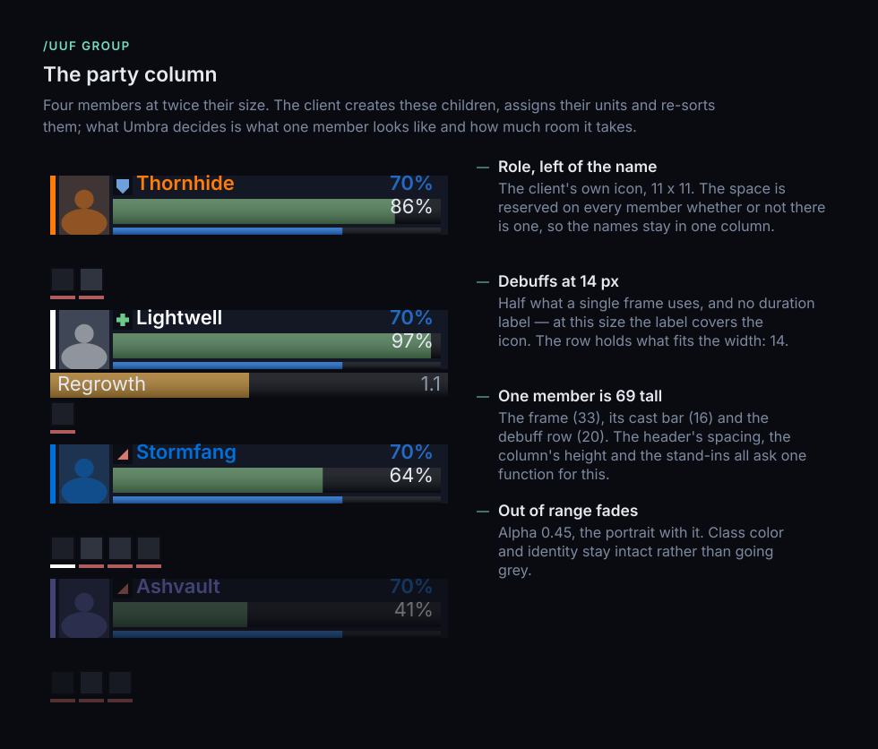
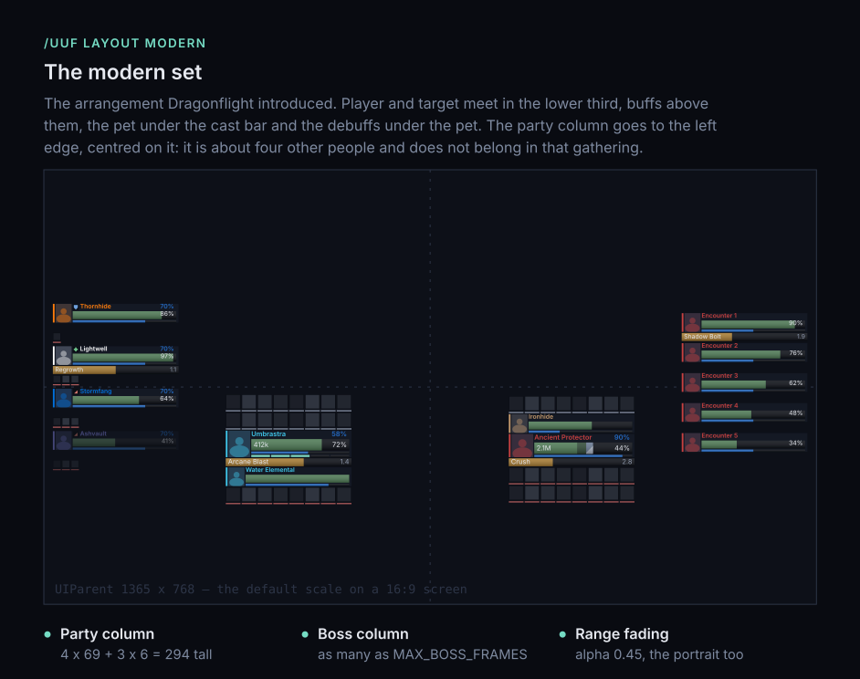
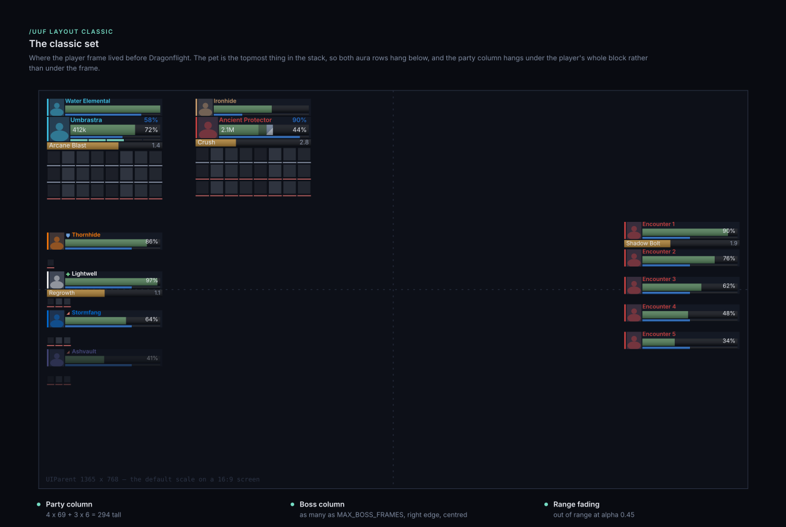

<div align="center">



# Umbra Unit Frames

**Your game. Front and center.**


[](https://github.com/krebs3r/umbra-unit-frames/releases/latest)
[](LICENSE)
[](https://github.com/sponsors/krebs3r)

</div>

---

**Umbra preserves the idea, not every old design decision.**

A project for modern, readable unit frames in World of Warcraft Retail, WoW: Forever and Mists of Pandaria Classic. Inspired by ShadowedUnitFrames, with a visual identity of its own: class-colored edges, rectangular character portraits beside the bars, and information right where you need it.

[The idea](#the-idea) · [Design principles](#design-principles) · [The frames](#the-frames) · [Using it](#using-it) · [Installing](#installing) · [Supported clients](#supported-clients) · [Contributing](#contributing)

> **Where it stands.** All six design principles are implemented, and every frame in [the table below](#the-frames) that is not marked otherwise. Everything is set in a small options window or through `/uuf`, which do the same, and Clique is not supported. Which version is current, the release badge above says; the [changelog](CHANGELOG.md) says what each one settled.

---

## The idea

Your character, your target, and your group should be the focus. The interface should help you understand their status — not compete for your attention.

Umbra brings together compact unit frames, a clear information hierarchy, and restrained styling. Rather than replacing the entire user interface, it stays with the unit frames: player, target, pet, target of target, the boss column and the party column.

> **Familiar to use. Distinct by design.**

### Why “Umbra”?

*Umbra* refers to the [dark inner region of a shadow](https://science.nasa.gov/moon/eclipses/). The name acknowledges the project's visual inspiration without simply repeating “Shadowed.”

It also captures the thinking behind the project: **The interface steps back. Your game stays in focus.**

## Design principles

Color, shape, and placement should make different kinds of information easy to distinguish. These six principles define Umbra's visual direction, and all six are implemented.

| Principle | Approach and purpose |
| :--- | :--- |
| **Class color at the edge** | A **3-pixel edge** and the character's name carry the class color. The health bar stays **neutral green** by default, and `/uuf health class` gives it the unit's color as well for anyone who would rather have it there. Class identity and health each have a distinct visual role. |
| **A dedicated portrait column** | A narrow, **rectangular character portrait** sits to the left of the name and bars—including on the target frame. Subtle class tinting replaces circular medallions, glowing portrait rings, and images behind the numbers. |
| **Resources as a hairline** | Mana, energy, and rage use a thin line rather than a second dominant bar. Health remains the primary information. |
| **Auras with an underline** | A slim colored line beneath each icon replaces a prominent full border. Personal and important effects stay easy to identify without cluttering the grid. |
| **Distinct shields and healing** | Hatching indicates absorbs; a light, translucent segment represents incoming healing. Both stay clearly distinguishable from current health. |
| **Range through fading** | Out-of-range units fade together with their portraits. Class color and character identity remain intact rather than being replaced by a grayscale filter. |

**Accent color belongs to the interface. Class color belongs to the unit. The health bar belongs to health.**



## The frames

Every frame shares the same anatomy — the portrait column, class color at the edge, the name, a health bar and the power hairline — and is then cut down to what it is for.



> The sheets on this page are **drawings, not screenshots**. `tools/mockups.py` redraws the frames from the same metrics `Core/Defaults.lua` lays them out with, deriving the heights and offsets rather than copying them, so what they can show is geometry and color. The fonts, the spell art in an icon and the portrait models belong to the client and stand in here.

| Frame | What it carries |
| :--- | :--- |
| **Player** | Cast bar, class power row, power value, 16 buff and 8 debuff slots. The pet hangs off it and takes a place in its stack. |
| **Target** | Cast bar, power value, 8 buff and 16 debuff slots — the other way round, because what you have put on the target is the reason to look at it. |
| **Pet** | The shared width, so it lines up, but shorter: no cast bar, no aura rows. |
| **Target of target** | One question — is it on the tank or on me — and cut like the pet. |
| **Boss** | As many as the client has (`MAX_BOSS_FRAMES`), identical to one another, each keeping its cast bar. No aura rows: five stacked frames with rows between them would be a wall. |
| **Party** | A column on the client's own secure group header, so the client creates the children, assigns their units and re-sorts them — in combat as well as out of it. Cast bar, power value, one row of debuffs at 14 pixels, the role each member signed up as, and range fading. **Not on the Forever beta** — see [Supported clients](#supported-clients). |
| **Raid** | Not yet, and not next. Blizzard's own raid frames do the job, class coloring included; the header carries these whenever they are wanted. |

There is deliberately **no focus frame**. One was built and taken out again, because a frame that never fills is a frame in the way. It costs a config entry and a point per layout set to put back.



## Using it

Two **layout sets** decide where everything goes, and each set remembers its own dragged positions. A set decides three things at once, because they only hold together as a set: where the frames sit, which side of a frame each aura row hangs on, and whether the pet sits above the player or below it.

**`modern`** — the default, and the arrangement Dragonflight introduced. Player and target meet in the lower third, buffs above them, the pet under the cast bar and the debuffs under the pet. The party column goes to the left edge, centred on it.



**`classic`** — where the player frame lived before Dragonflight. The pet is the topmost thing in the stack, so both aura rows hang below, and the party column hangs under the player's whole block rather than under the frame.



The boss column is the same in both: the right edge, centred, as many frames as the client has. It is not part of the arrangement you chose — it is something the fight brings.

`/uuf` on its own opens the options window. It is also in the addon compartment under the minimap on Retail and Forever, on a minimap button on the Classic clients, and under *Options › AddOns* on all of them. Every setting in it takes effect where you stand — no `/reload`:


The window offers nothing the commands do not, and `/uuf help` lists them:

| Command | Values | What it does |
| :--- | :--- | :--- |
| `/uuf` | — | the options window |
| `/uuf help` | — | this list |
| `/uuf layout` | `classic`, `modern` | the whole arrangement |
| `/uuf auras` | `umbra`, `both` | who shows your buffs and debuffs |
| `/uuf health` | `class`, `plain` | what colors the health bars |
| `/uuf group` | `umbra`, `both` | whether the game's group manager stays on the left edge |
| `/uuf unlock` | — | drag the frames, every one of them, filled out |
| `/uuf lock` | — | put them back to work |
| `/uuf reset` | — | forget this set's dragged positions |
| `/uuf dev` | — | measurements and diagnostics, listed behind that word |

Given without a value, each setting prints what it is on and what the alternatives mean. The defaults are `modern`, `both`, `plain`, `both`: Blizzard's own aura display and group panel stay up until you say otherwise, because the panel carries the raid markers and the way out of a group.

Switching Blizzard's frames off in combat is a promise rather than a result — those frames are protected — and the reply says so when that happens.

### Measurements

`/uuf dev` lists what this addon can ask the client it is running on. They report, they change nothing, and they are what a good bug report is made of:

| Command | What it answers |
| :--- | :--- |
| `/uuf dev check` | which unit values this client hides |
| `/uuf dev header` | whether a secure group header works on this client |
| `/uuf dev party` | what the party column is made of, child by child |
| `/uuf dev test` | fills every aura slot with stand-ins, so a layout can be judged full — run it again to stop |
| `/uuf dev debug` | what the build refused |

`check`, `header` and `party` answer in a window you can copy out of; the other two write to chat. `check` also has a **key binding** under *AddOns*, for the case where the chat frame is what has gone wrong.

## Installing

The addon folder is named `UmbraUnitFrames` and the slash command is `/uuf`. An unrelated addon named *Umbra* already exists; the longer name keeps both installable side by side.

### From a release

Take the `UmbraUnitFrames` zip from [the latest release](https://github.com/krebs3r/umbra-unit-frames/releases/latest) and unpack it into `Interface\AddOns` — `_retail_\Interface\AddOns` for Retail, `_classic_beta_\Interface\AddOns` for the Forever beta, `_classic_\Interface\AddOns` for Mists of Pandaria Classic, `_anniversary_\Interface\AddOns` for the Anniversary realms, `_classic_era_\Interface\AddOns` for Classic Era.

One package carries every TOC file rather than one build per flavor, and the release publishes a `release.json` next to it that an addon manager reads to pick for itself.

### Running from a checkout

Copying the clone directly into `AddOns` does not work, and it fails silently: the addon simply never appears in the list. Two things differ from a released build.

1. **The folder must be named `UmbraUnitFrames`.** WoW looks for `Foo_Mainline.toc` only inside a folder named `Foo`, so a clone directory named `umbra-unit-frames` is never inspected.
2. **`Libs/oUF` is not in the repository.** It is fetched at build time and ignored by git, so a checkout has to provide it.

`tools/install.ps1` handles both. Pass the WoW path once; it is remembered afterwards.

```powershell
.\tools\install.ps1 -WowPath "C:\Games\World of Warcraft"
```

```powershell
.\tools\install.ps1 -Flavor forever
```

```powershell
.\tools\install.ps1 -Flavor mists
```

Re-run it after every change, then `/reload` in the client. Adding the folder for the first time needs a full client restart, because the addon list is only read at launch.

## Supported clients

Umbra targets **Retail**, **WoW: Forever** and **Mists of Pandaria Classic**. All three are one codebase with one copy of oUF. Forever runs the Mainline UI architecture on Vanilla content, and Mists, although it reports itself as a Classic client, carries almost all of the Midnight API in 5.5.4.

| | Retail (Midnight) | WoW: Forever | Mists of Pandaria Classic | Anniversary (Burning Crusade) | Classic Era |
| :--- | :--- | :--- | :--- | :--- | :--- |
| Interface | `120100`, `120105` | `16001` | `50504` | `20506` | `11509` |
| `WOW_PROJECT_ID` | Mainline | Mainline | Mists Classic | Burning Crusade Classic | Classic |
| API surface | 12.1.5 | 12.1.5, minus parts | 12.x, minus four things | the same as Mists | the same as Mists |
| Secret Values | yes | yes | the API is there | the API is there | the API is there |
| TOC suffix | `_Mainline` | `_Camelot` | `_Mists` | `_TBC` | `_Vanilla` |
| Umbra support | yes — verified inside an instance | yes, with two exceptions | new — frames, auras and the header seen working | new — frames, auras and portraits seen working | new — frames, auras and portraits seen working |

**Mists was checked against Blizzard's own interface code**, not yet in play. Every client function oUF and Umbra call was looked up in the API documentation that build 5.5.4.69934 ships with. Two were missing, and the first login found a third:

- **The aura container.** oUF builds its aura rows from the client's `AuraContainer` widget, and Mists has neither that widget nor `AddDispelTypeTexture`. Where the client refuses a container, Umbra builds the row itself from plain buttons, cut by the same function and packed by the same arithmetic. The dispel color on the underline, the countdown and right-click to cancel a buff are done in Lua on those rows; cancelling works out of combat only.
- **`GetUnitChargedPowerPoints`**, which oUF reads combo points through. `Compat/Classic.lua` answers nil, as Retail does for a unit without charged points.
- **`SetRolesets`**, a widget method oUF calls on every frame it builds. Rolesets are Midnight's rules for what an addon may do to a frame, and oUF also hides Blizzard's own frames through one. `Compat/Classic.lua` adds the method: for Umbra's frames it does nothing, and for Blizzard's it hides them the way oUF did before Midnight.

The secure group header uses the same machinery as on Retail, and unlike Forever it finishes its children: `/uuf dev header` built and configured one on Mists, solo. A real party is the next thing to watch it with.

What oUF's class power row does not know about Mists stays empty: Eclipse, Shadow Orbs, Burning Embers and Demonic Fury. Chi appears for Windwalker only, which is how oUF reads a Retail monk. Whether combo points arrive, when Mists keeps them on the target, is the first thing to look at.

**The party column does not work on the Forever beta**, and the reason is below every addon: that client compiles each secure snippet with `loadstring_untainted`, the function is missing there, and the client's own group-header code uses it to configure every child it creates. So the header makes buttons it cannot finish — no unit, no style — by oUF or by anyone else.

Umbra notices and steps back: two seconds after its column would first appear it checks whether any child was given a unit, and if none was, it hides itself, stops asking the client, and hands Blizzard's group panel back whatever `/uuf group` says. Everything else — the single frames, auras, cast bars, portraits — is unaffected.

No second party column out of fixed frames is planned for it. That would mean no sorting, no changes during a fight, and a second implementation to maintain — for a client that may simply have the function by the time it launches, or in a later beta. `/uuf dev header` answers where any given client stands.

**And it does not remember.** That client writes its saved variables on exit and never reads them back: `ADDON_LOADED` sees an empty table, Umbra fills in its defaults, and the next save writes those over what was there. Every reload costs a generation, and the `.bak` beside the file is the only thing still holding the one before. The write is correct — it is the reading that never happens, and a store of our own would be a second mechanism carried forever for a beta. The [development notes](docs/development.md) have the file that proves which half is broken.

Forever launches **4 November 2026**. What its beta client actually did with Umbra — which values it hides, which events it is missing — is written down in the [development notes](docs/development.md).

The old Classic globals—`UnitAura`, `GetSpellInfo`, `GetItemInfo`, `CombatLogGetCurrentEventInfo`—do not exist on Forever. Code is written against the Retail API and the handful of Forever deviations live in `Compat/Forever.lua`.

**The Anniversary client got the same check**, against build 2.5.6.69795, and came back with exactly the gaps Mists has — so `Compat/Classic.lua` answers both. What Burning Crusade has no use for simply stays empty: the boss column, and every class power but combo points.

**Classic Era got it too**, against 1.15.9.69722, with the same answer — so one compatibility file, `Compat/Classic.lua`, covers all three Classic clients. Era has even less to fill the class power row with than Burning Crusade: combo points only.

### What Secret Values change

Since patch 12.0 the client returns opaque values for health, power and aura data inside encounters, Mythic+ runs and PvP matches. An addon may hand such a value to the client for display, but may not read it, compare it, or calculate with it.

This suits Umbra's design better than most: a neutral health bar with class color at the edge never needs to derive a color from a health value, so the bar looks and behaves the same inside an encounter as outside one. Two consequences are visible to you:

- **Health reads as a percentage.** The number itself is not lost—the client can still render a hidden value—but nothing may be *derived* from it. Custom thresholds, or a bar color that shifts as health drops, are not possible while the value is hidden.
- **Auras are drawn through Blizzard's aura containers** on Retail and Forever, which constrains how freely icons can be arranged. Mists has no such container, so there Umbra draws the same buttons itself.

`/uuf dev check` prints which of these values the client is hiding right now, which is how any of it gets decided rather than assumed.

## Contributing

Feedback, bug reports, and focused improvements are welcome. It is especially helpful to explain **which information a change makes easier to read or understand**.

A bug report should identify the affected frame, selected layout, version, and steps to reproduce the issue — `/uuf dev check` and `/uuf dev party` give you most of that in a window you can copy out of.

The sheets in `assets/design/` are generated rather than drawn by hand — `python tools/mockups.py` rebuilds all five. That file keeps its own copy of the metrics, so a number changed in `Core/Defaults.lua` has to be changed there too, or the sheets quietly start claiming something the addon no longer does.

The [development notes](docs/development.md) are where the reasoning lives: what the client actually does, what is built, and what comes next. Please discuss larger changes in an [issue](https://github.com/krebs3r/umbra-unit-frames/issues) first, and document the source and licensing of any code or assets you contribute.

Umbra is free and stays free — nothing here is held back for sponsors. If it earns a place in your interface and you would like to support the work anyway, [GitHub Sponsors](https://github.com/sponsors/krebs3r) is the only channel set up for it.

## Credits

ShadowedUnitFrames is the visual inspiration behind Umbra. Thank you to the original authors and the community who have carried this idea through so many versions of WoW.

- [Shadowed / ShadowedUnitFrames](https://github.com/Shadowed/ShadowedUnitFrames)
- [Nevcairiel / ShadowedUnitFrames](https://github.com/Nevcairiel/ShadowedUnitFrames)
- [NoSelph / ShadowedUnitFrames](https://github.com/NoSelph/ShadowedUnitFrames)

Listing these projects does not imply that their code is already included in Umbra. Umbra is an **independent project**, not an official successor to ShadowedUnitFrames, and is not affiliated with Blizzard Entertainment.

The inspiration is visual only. ShadowedUnitFrames carries no license file, which means no permission to reuse its code has been granted—so none of it is used here, and none of it may be contributed.

Umbra is built on [oUF](https://github.com/oUF-wow/oUF) (MIT), which is embedded at build time rather than checked in.

## License

Umbra's own code is [MIT licensed](LICENSE). If this project ever goes quiet, someone else can pick it up—which is precisely what ShadowedUnitFrames could not offer.

Embedded third-party components keep their own terms: oUF is MIT.

---

<div align="center">

**UMBRA UNIT FRAMES**

*Less clutter. More clarity. Your game. Front and center.*

</div>
